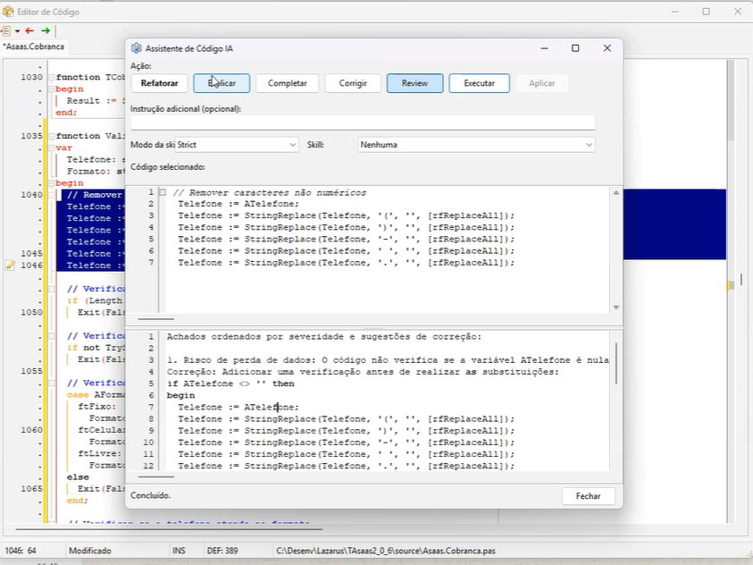
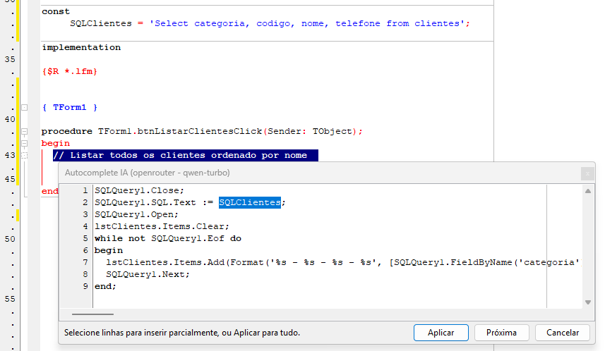

# LazarusSpecKit-Plugin

**AI-powered Spec-Driven Development wizard for the Lazarus IDE.**

A dockable IDE plugin for Lazarus 4.4+ that integrates multiple AI providers in three modes: **Ask**, **Plan**, and **Agent**.

Supported providers:
- [Groq](https://groq.com)
- [Qwen / DashScope](https://dashscope.console.aliyun.com/)
- [OpenRouter](https://openrouter.ai)
- Ollama (UI/config available; requests currently fall back to Groq)

This repository contains the **plugin project only**. Skills are loaded from a separate local clone of [lazarus-spec-kit](https://github.com/delphicleancode/lazarus-spec-kit).

---

## Features

| Mode | Description |
|------|-------------|
| **Ask** | Quick Q&A with a Free Pascal/Lazarus expert AI |
| **Plan** | Generate a complete SDD (Spec-Driven Development) specification |
| **Agent** | Iterative code generation — creates files, inserts code into the active editor |

### Skills (from lazarus-spec-kit)
- Clean Code & Pascal Guide
- Memory Management & Exceptions
- Lazarus Patterns (Repository, Service, Factory)
- Design Patterns GoF
- Refactoring (10 techniques)
- TDD with FPCUnit
- Firebird / PostgreSQL / MySQL Repository patterns
- Threading (TThread)
- Horse REST Framework, IntraWeb, ACBr

### Screenshots





---

## Requirements

- **Lazarus 4.4+** with FPC 3.2.2+
- **OpenSSL** (`libssl-3-x64.dll`, `libcrypto-3-x64.dll`) on Windows PATH
- **API key** for your selected provider:
  - Groq: [console.groq.com](https://console.groq.com)
  - Qwen/DashScope: see [docs/QWEN_APIKEY_GUIDE.md](docs/QWEN_APIKEY_GUIDE.md)
  - OpenRouter: see [docs/OPENROUTER_APIKEY_GUIDE.md](docs/OPENROUTER_APIKEY_GUIDE.md)

---

## Installation

See [docs/INSTALL.md](docs/INSTALL.md) for full instructions.

**Quick start:**
1. Open `LazSpecWizard.lpk` in Lazarus
2. **Package → Install Package** (IDE rebuilds and restarts)
3. Go to **Tools → Spec Wizard** or press `Ctrl+Shift+K`
4. Click ⚙️, choose your provider, and fill API key / provider URL as needed

### Separate skills repository
If you want the full skill set, clone `lazarus-spec-kit` separately and point **Spec-Kit Path** to that folder in plugin settings.

---

## Project Structure

```
LazarusSpecKit/
├── LazSpecWizard.lpk           # Lazarus package
├── src/
│   ├── registration/           # IDE hook (procedure Register)
│   ├── ui/                     # Dockable form + Settings dialog
│   ├── core/                   # SDD engine, prompt builder, context memory
│   ├── infra/                  # Groq client, settings, skills loader
│   └── ide/                    # Editor, project, and file helpers
├── lazarus-spec-kit/           # Optional local clone (ignored by Git)
├── tests/                      # FPCUnit test project
└── docs/                       # Documentation
```

---

## Usage

### Ask Mode
Type any Free Pascal/Lazarus question and press **Send** (or `Enter`).
The AI responds based on FPC conventions enforced by the spec-kit rules.

### Plan Mode
Describe what you want to build. The AI generates a full SDD including:
- Specification
- Technical plan and architecture
- Unit structure
- Interface/class definitions
- Test plan (FPCUnit)

Select skills from the checklist to guide the AI (e.g., enable "Firebird Database" for DB-heavy features).

### Agent Mode
Describe what code to write. The AI generates compilable Free Pascal units.
- **Apply** button: inserts code at cursor in the active editor
- **Create File** button: creates a new `.pas` file and opens it in the IDE

---

## Configuration

Settings are stored in `<LazarusConfig>/specwizard.xml`.

| Setting | Default | Description |
|---------|---------|-------------|
| Provider | `groq` | `groq`, `qwen`, `openrouter`, or `ollama` |
| API Key | _(empty)_ | API key used by the selected provider |
| Model | `llama-3.3-70b-versatile` | AI model |
| Qwen URL | `https://dashscope.aliyuncs.com/compatible-mode/v1` | Base URL for Qwen provider |
| OpenRouter URL | `https://openrouter.ai/api/v1` | Base URL for OpenRouter provider |
| Ollama URL | `http://localhost:11434` | Local endpoint (Ollama mode currently falls back to Groq in engine) |
| Max Tokens | `4096` | Max response length |
| Temperature | `0.7` | Response creativity (0.0–1.0) |
| Spec-Kit Path | _(auto-detect)_ | Path to cloned lazarus-spec-kit |

---

## Architecture

```
LazSpecWizardReg (Register)
  └── IDEWindowCreators → TSpecWizardForm (dockable)
       ├── TSDDEngine
       │    ├── TPromptBuilder   — assembles system + skills + history + user message
       │    ├── TContextMemory   — persists conversation to .lazspec/history.json
        │    └── Provider clients — `TGroqClient`, `TQwenClient`, `TOpenRouterClient`
       ├── TSkillsLoader        — scans lazarus-spec-kit/.gemini/skills/
       └── TSpecSettings        — persists to <LazarusConfig>/specwizard.xml
```

Provider-specific setup guides:
- [docs/QWEN_APIKEY_GUIDE.md](docs/QWEN_APIKEY_GUIDE.md)
- [docs/OPENROUTER_APIKEY_GUIDE.md](docs/OPENROUTER_APIKEY_GUIDE.md)

---

## Contributing

Contributions welcome! Please follow the patterns from [lazarus-spec-kit](https://github.com/delphicleancode/lazarus-spec-kit).

## License

MIT
