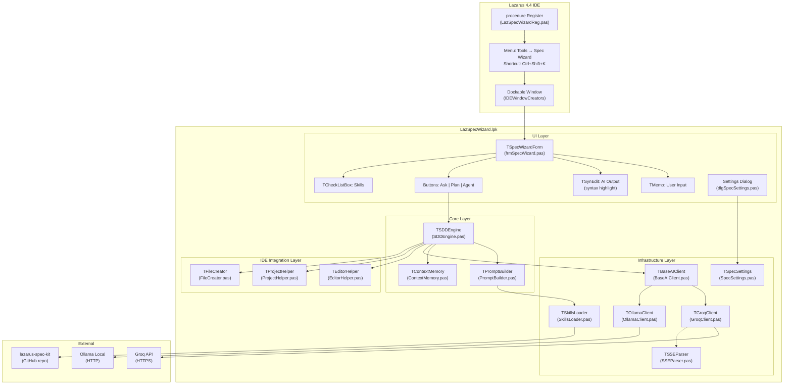
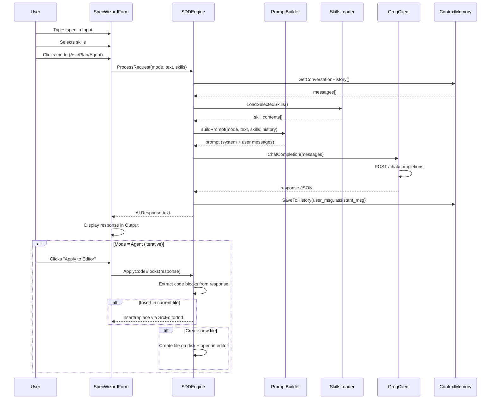

# LazarusSpecKit — IDE Plugin with AI Chat and SDD Generation

A dockable plugin for the Lazarus 4.4 IDE that integrates AI chat (Groq/Ollama) in Ask/Plan/Agent modes to generate SDD specs, code, and tests based on the [lazarus-spec-kit](https://github.com/delphicleancode/lazarus-spec-kit).

## Resolved Requirements

| # | Question | Answer |
|---|----------|--------|
| 1 | Lazarus Version | **4.4** (FPC 3.2.2) |
| 2 | OpenSSL on Windows | **Already available** on the OS |
| 3 | lazarus-spec-kit | **Git clone/pull** from `https://github.com/delphicleancode/lazarus-spec-kit` |
| 4 | Agent Mode Scope | **Create new files** in addition to inserting code in editor |
| 5 | Interface Language | **English only** |

> [!IMPORTANT]
> **Critical Technical Correction**: The original PRD references "OTA (Open Tools API)" with interfaces like `IOTAWizard`, `IOTAProjectWizard`, and `IOTAEditWriter`. **These APIs are exclusive to Delphi and do NOT exist in Lazarus.** Lazarus uses the `IDEIntf` package with a completely different registration system. This plan uses the correct Lazarus API.

---

## Technical Architecture

### Component Diagram



### Execution Flow



---

## File Structure

```
c:\Desenv\Lazarus\LazarusSpecKit\
├── LazSpecWizard.lpk                    # Main package
├── LazSpecWizard.lrs                    # Resources (icons)
├── prd-lazarus-spec-kit.md              # PRD (existing)
├── README.md                            # Documentation
│
├── src\                                 # Source code
│   ├── registration\
│   │   └── LazSpecWizardReg.pas         # procedure Register
│   │
│   ├── ui\
│   │   ├── frmSpecWizard.pas            # Main dockable form
│   │   ├── frmSpecWizard.lfm            # Form layout
│   │   └── dlgSpecSettings.pas          # Settings dialog
│   │
│   ├── core\
│   │   ├── SDDEngine.pas               # SDD engine (Ask/Plan/Agent)
│   │   ├── PromptBuilder.pas           # Prompt builder
│   │   └── ContextMemory.pas           # Local context memory
│   │
│   ├── infra\
│   │   ├── BaseAIClient.pas            # Abstract base class / interface
│   │   ├── GroqClient.pas              # HTTP client for Groq API
│   │   ├── OllamaClient.pas            # HTTP client for Ollama
│   │   ├── SkillsLoader.pas            # Skills loader from spec-kit
│   │   ├── SpecSettings.pas            # Persistent settings
│   │   └── SSEParser.pas               # SSE parser for streaming
│   │
│   └── ide\
│       ├── EditorHelper.pas            # Source Editor integration
│       ├── ProjectHelper.pas           # Project integration
│       └── FileCreator.pas             # Create new files + add to project
│
├── lazarus-spec-kit\                    # Git submodule / cloned repo
│   ├── .claude\skills\...              # Claude skills
│   ├── .gemini\skills\...              # Gemini skills
│   ├── .cursor\rules\...               # Cursor rules
│   ├── .kiro\steering\...              # Kiro steerings
│   ├── AGENTS.md
│   └── ...
│
├── tests\                               # Test project
│   ├── TestLazSpecKit.lpi
│   ├── TestLazSpecKit.lpr
│   ├── TestGroqClient.pas
│   ├── TestPromptBuilder.pas
│   └── TestSkillsLoader.pas
│
└── docs\
    └── INSTALL.md                       # Installation guide
```

---

## Proposed Changes

### Component 1: Package and IDE Registration

#### [NEW] [LazSpecWizard.lpk](file:///c:/Desenv/Lazarus/LazarusSpecKit/LazSpecWizard.lpk)

Lazarus package XML. Configuration:

- **Type**: Design-time only (installed into the IDE)
- **Requires**: `IDEIntf`, `LCL`, `SynEdit`
- **Register unit**: `LazSpecWizardReg`
- **Output directory**: `lib/$(TargetCPU)-$(TargetOS)`
- **Target Lazarus**: 4.4+

#### [NEW] [LazSpecWizardReg.pas](file:///c:/Desenv/Lazarus/LazarusSpecKit/src/registration/LazSpecWizardReg.pas)

Registration unit with `procedure Register;`:

- Registers menu item in `itmSecondaryTools` (Tools menu): "Spec Wizard"
- Registers keyboard shortcut: `Ctrl+Shift+K`
- Registers dockable window via `IDEWindowCreators.Add()`
- Handles `OnIDERestoreWindows` for dockable window restoration

```pascal
procedure Register;
begin
  // Menu command under Tools
  RegisterIDEMenuCommand(itmSecondaryTools, 'LazSpecWizard',
    'Spec Wizard', nil, @ShowSpecWizardWindow);

  // Dockable window creator (right-side panel, 30% width)
  IDEWindowCreators.Add(SpecWizardFormName,
    @CreateSpecWizardForm, nil,
    '70%', '0', '30%', '100%');

  // Restore on IDE start
  LazarusIDE.AddHandlerOnIDERestoreWindows(@RestoreSpecWizard);
end;
```

---

### Component 2: User Interface

#### [NEW] [frmSpecWizard.pas](file:///c:/Desenv/Lazarus/LazarusSpecKit/src/ui/frmSpecWizard.pas)

Main dockable form with layout:

| Area | Component | Description |
|------|-----------|-------------|
| Top | `TPanel` + 3× `TSpeedButton` | Modes: Ask / Plan / Agent |
| Top-Right | `TSpeedButton` | Settings (⚙️), Clear (🗑️) |
| Left Panel | `TCheckListBox` | Selectable skills list |
| Center | `TSynEdit` (read-only) | AI output with syntax highlighting |
| Bottom | `TMemo` + `TButton` | User input + Send button |
| Status Bar | `TStatusBar` | Model, tokens, connection status |

**Behaviors:**

- **Ask**: Simple question → display response
- **Plan**: Generate full SDD based on spec + selected skills
- **Agent**: Iterative mode — generate code, allow apply to editor or create new files
- `Enter` in TMemo sends (Ctrl+Enter for new line)
- "Clear" button resets conversation
- "Copy" button copies response to clipboard
- "Apply" button inserts code blocks into active editor (Agent mode)
- "Create File" button creates new file from response code blocks (Agent mode)

#### [NEW] [dlgSpecSettings.pas](file:///c:/Desenv/Lazarus/LazarusSpecKit/src/ui/dlgSpecSettings.pas)

Settings dialog (accessible via ⚙️ button):

- API Key (Groq) with masked field
- Selected model (dropdown: llama-3.3-70b-versatile, etc.)
- Provider (Groq / Ollama)
- Ollama base URL (default: <http://localhost:11434>)
- Max response tokens
- Temperature
- lazarus-spec-kit local path (auto-detected or manual)
- "Update Skills" button (runs `git pull` on spec-kit)

---

### Component 3: AI Client (Groq + Ollama)

#### [NEW] [BaseAIClient.pas](file:///c:/Desenv/Lazarus/LazarusSpecKit/src/infra/BaseAIClient.pas)

Abstract interface for AI clients:

```pascal
type
  TAIMessage = record
    Role: string;    // 'system', 'user', 'assistant'
    Content: string;
  end;
  TAIMessages = array of TAIMessage;

  TAIResponse = record
    Content: string;
    Model: string;
    PromptTokens: Integer;
    CompletionTokens: Integer;
    FinishReason: string;
  end;

  ISpecAIClient = interface
    ['{...GUID...}']
    function ChatCompletion(const AMessages: TAIMessages;
      const AModel: string; AMaxTokens: Integer;
      ATemperature: Double): TAIResponse;
    function TestConnection: Boolean;
    function GetAvailableModels: TStringList;
  end;
```

#### [NEW] [GroqClient.pas](file:///c:/Desenv/Lazarus/LazarusSpecKit/src/infra/GroqClient.pas)

Groq API client implementation:

- `TFPHTTPClient` for HTTP requests
- `opensslsockets` in uses for HTTPS
- Headers: `Authorization: Bearer <key>`, `Content-Type: application/json`
- Endpoint: `POST https://api.groq.com/openai/v1/chat/completions`
- Default model: `llama-3.3-70b-versatile`
- 120s timeout (for large responses)
- Error handling: HTTP 401 (auth), 429 (rate limit), 500 (server)

#### [NEW] [OllamaClient.pas](file:///c:/Desenv/Lazarus/LazarusSpecKit/src/infra/OllamaClient.pas)

Ollama client implementation (Phase 3):

- Endpoint: `POST http://localhost:11434/api/chat`
- No API key required
- Auto-detection of available models via `GET /api/tags`

---

### Component 4: SDD Engine and Skills

#### [NEW] [SDDEngine.pas](file:///c:/Desenv/Lazarus/LazarusSpecKit/src/core/SDDEngine.pas)

Main engine orchestrating modes:

```pascal
type
  TSpecMode = (smAsk, smPlan, smAgent);

  TSDDEngine = class
  private
    FAIClient: ISpecAIClient;
    FPromptBuilder: TPromptBuilder;
    FContextMemory: TContextMemory;
    FSkillsLoader: TSkillsLoader;
    FEditorHelper: TEditorHelper;
    FFileCreator: TFileCreator;
  public
    function ProcessRequest(AMode: TSpecMode;
      const AUserInput: string;
      const ASelectedSkills: TStrings): string;
    procedure ApplyCodeToEditor(const ACode: string);
    procedure CreateNewFile(const AFileName, ACode: string);
    procedure ClearContext;
    property OnResponseChunk: TNotifyEvent;  // for streaming
  end;
```

**System prompts by mode:**

- **Ask**: _"You are an expert in Free Pascal/Lazarus development. Answer clearly and directly."_
- **Plan**: _"Generate a complete SDD (Spec-Driven Development). Use the provided skills as guidelines. Include: specification, technical plan, unit structure, and tests."_
- **Agent**: _"You are an iterative development agent. Generate compilable Free Pascal code. When requested, apply refactorings based on active skills. Wrap code output in fenced code blocks with the target filename as comment."_

#### [NEW] [PromptBuilder.pas](file:///c:/Desenv/Lazarus/LazarusSpecKit/src/core/PromptBuilder.pas)

Prompt constructor that assembles the message array:

1. System message (mode context)
2. Skills as part of system prompt
3. Project context (active unit, project name, active selection)
4. Conversation history (last N messages)
5. User message

#### [NEW] [ContextMemory.pas](file:///c:/Desenv/Lazarus/LazarusSpecKit/src/core/ContextMemory.pas)

Local context memory per project:

- Saves history in JSON in project directory (`.lazspec/history.json`)
- Limits to last 20 messages to stay within model context
- `ClearContext` method to reset
- Data stays local (LGPD compliant)

#### [NEW] [SkillsLoader.pas](file:///c:/Desenv/Lazarus/LazarusSpecKit/src/infra/SkillsLoader.pas)

Skills loader from the lazarus-spec-kit repository:

- Scans `.gemini/skills/` directory for `SKILL.md` files
- Also scans `.cursor/rules/` for `.md` files
- Builds a unified skill list with id, name, category, and file path
- Provides list for the TCheckListBox in the form
- Supports `git pull` to update skills from remote

**Available skills from the repo:**

| Skill | Source Path | Category |
|-------|-----------|----------|
| Clean Code & Pascal Guide | `.gemini/skills/clean-code/SKILL.md` | Architecture |
| Memory & Exceptions | `.gemini/skills/lazarus-memory-exceptions/SKILL.md` | Safety |
| Lazarus Patterns | `.gemini/skills/lazarus-patterns/SKILL.md` | Architecture |
| Design Patterns GoF | `.gemini/skills/design-patterns/SKILL.md` | Architecture |
| Refactoring | `.gemini/skills/refactoring/SKILL.md` | Quality |
| TDD with FPCUnit | `.gemini/skills/tdd-fpcunit/SKILL.md` | Testing |
| Testing FPCUnit | `.gemini/skills/test-fpcunit/SKILL.md` | Testing |
| Horse Framework | `.gemini/skills/horse-framework/SKILL.md` | Framework |
| IntraWeb | `.gemini/skills/intraweb-framework/SKILL.md` | Framework |
| ACBr Components | `.gemini/skills/acbr-components/SKILL.md` | Framework |
| Firebird Database | `.gemini/skills/firebird-database/SKILL.md` | Database |
| PostgreSQL Database | `.gemini/skills/postgresql-database/SKILL.md` | Database |
| MySQL Database | `.gemini/skills/mysql-database/SKILL.md` | Database |
| Threading | `.gemini/skills/threading/SKILL.md` | Concurrency |
| Code Review | `.gemini/skills/code-review/SKILL.md` | Quality |

---

### Component 5: IDE Integration

#### [NEW] [EditorHelper.pas](file:///c:/Desenv/Lazarus/LazarusSpecKit/src/ide/EditorHelper.pas)

Source Editor integration helper:

- `GetActiveSourceCode`: Returns full source of active editor
- `GetSelectedText`: Returns current selection
- `GetActiveFileName`: Returns active file name
- `InsertTextAtCursor`: Inserts text at cursor position
- `ReplaceSelectedText`: Replaces current selection
- Uses `SourceEditorManagerIntf` and `SrcEditorIntf` from IDEIntf

#### [NEW] [ProjectHelper.pas](file:///c:/Desenv/Lazarus/LazarusSpecKit/src/ide/ProjectHelper.pas)

Project context helper:

- `GetProjectName`: Returns project name
- `GetProjectPath`: Returns project directory
- `GetProjectUnits`: Lists all project units
- Uses `LazIDEIntf` and `ProjectIntf`

#### [NEW] [FileCreator.pas](file:///c:/Desenv/Lazarus/LazarusSpecKit/src/ide/FileCreator.pas)

File creation for Agent mode:

- `CreateUnitFile(FileName, Source)`: Creates a new `.pas` file on disk, opens in editor
- `CreateAndAddToProject(FileName, Source)`: Creates file + adds to project
- Uses `LazIDEIntf.DoNewEditorFile` and `LazIDEIntf.DoOpenEditorFile`

---

### Component 6: Settings

#### [NEW] [SpecSettings.pas](file:///c:/Desenv/Lazarus/LazarusSpecKit/src/infra/SpecSettings.pas)

Persistent settings via `GetIDEConfigStorage`:

| Setting | Type | Default |
|---------|------|---------|
| APIKey | string | (empty) |
| Provider | string | 'groq' |
| Model | string | 'llama-3.3-70b-versatile' |
| OllamaURL | string | '<http://localhost:11434>' |
| MaxTokens | Integer | 4096 |
| Temperature | Double | 0.7 |
| SpecKitPath | string | (auto-detect) |

Stored in `<LazarusConfigPath>/specwizard.xml`.

---

### Component 7: SSE Streaming (Phase 3)

#### [NEW] [SSEParser.pas](file:///c:/Desenv/Lazarus/LazarusSpecKit/src/infra/SSEParser.pas)

Server-Sent Events parser for streaming responses:

- HTTP chunk buffering
- Line identification `data: {...}`
- Detection of `data: [DONE]`
- Callback for incremental UI update
- Separate thread to avoid blocking the IDE

---

## Detailed Schedule

### Phase 1 — MVP: Basic Chat + Ask Mode (Week 1)

| Day | Task | Deliverable |
|-----|------|-------------|
| D1 | Package `.lpk` setup + IDE registration | `LazSpecWizard.lpk` + `LazSpecWizardReg.pas` compiling and installing |
| D2 | Basic dockable form | `frmSpecWizard.pas` — TMemo input + TSynEdit output + Send button |
| D3 | Groq client (non-streaming) | `GroqClient.pas` — functional POST to Groq endpoint |
| D4 | Ask mode integration | `SDDEngine.pas` + `PromptBuilder.pas` — Ask mode end-to-end |
| D5 | Settings + testing | `SpecSettings.pas` + `dlgSpecSettings.pas` + manual IDE test |

**MVP Deliverable**: Wizard installed in IDE with functional Ask mode chat via Groq.

---

### Phase 2 — Full SDD: Plan + Agent (Weeks 2-3)

| Day | Task | Deliverable |
|-----|------|-------------|
| D6-D7 | Skills system | `SkillsLoader.pas` + git clone lazarus-spec-kit + scan skills |
| D8-D9 | Plan mode | PromptBuilder with SDD templates + injected skills |
| D10 | Context memory | `ContextMemory.pas` — local JSON persistence |
| D11-D12 | Agent mode | Iteration + code block extraction from response |
| D13 | Source Editor integration | `EditorHelper.pas` — insert/replace code |
| D14 | File creation + Project integration | `FileCreator.pas` + `ProjectHelper.pas` — create new units |
| D15 | Testing and refinement | End-to-end test of all 3 modes |

**Phase 2 Deliverable**: 3 functional modes with spec-kit skills and IDE integration.

---

### Phase 3 — Polish and Expansion (Week 4)

| Day | Task | Deliverable |
|-----|------|-------------|
| D16 | SSE Streaming | `SSEParser.pas` — incremental response in UI |
| D17 | Ollama client | `OllamaClient.pas` — local model integration |
| D18 | UI polish | TSynEdit with proper syntax highlighting + icons |
| D19 | Documentation | `README.md` + `INSTALL.md` |
| D20 | Additional testing | Real project testing |

**Final Deliverable**: Complete, polished, documented plugin with Groq + Ollama support.

---

## Verification Plan

### Automated Tests

- **`TGroqClient` unit test**: Mock HTTP to validate request JSON construction and response parsing
- **`TPromptBuilder` unit test**: Validate prompt assembly for each mode
- **`TSkillsLoader` unit test**: Validate skill loading from disk
- **`TContextMemory` unit test**: Validate persistence and reading history
- **`TSSEParser` unit test**: Validate SSE chunk parsing

### Manual Verification

1. **Compilation**: Package `.lpk` compiles without errors/warnings on Lazarus 4.4
2. **Installation**: Package installs into IDE without errors, IDE restarts normally
3. **Menu**: "Spec Wizard" item appears in Tools menu
4. **Dockable Window**: Opens, closes, docks, and restores position
5. **Ask Mode**: Send question → receive response from Groq
6. **Plan Mode**: Generate SDD with selected skills
7. **Agent Mode**: Generate code → apply to editor → create new file
8. **Settings**: Save/load API key and preferences
9. **Real project test**: Use on an existing Lazarus project
